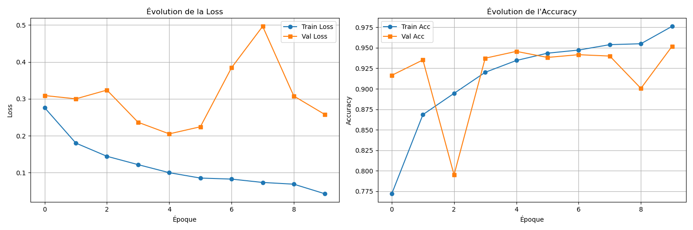
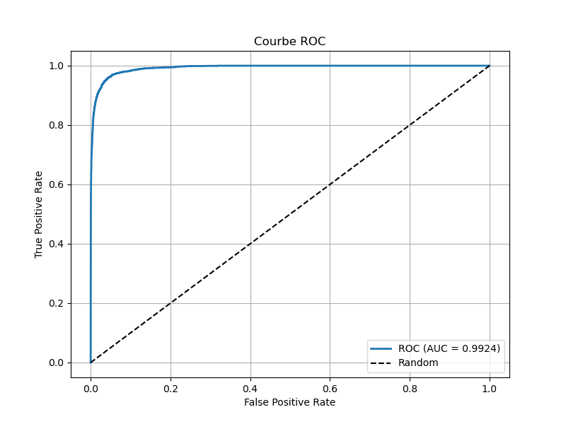
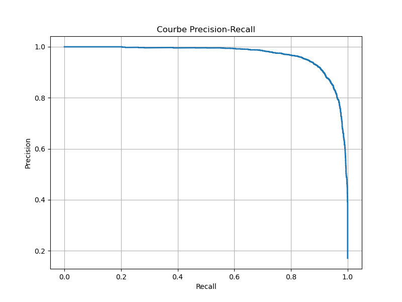

# Classification d'Images Thoraciques COVID-19 : Pipeline de Deep Learning

> **Documentation scientifique et technique complète**  
> Pour une vue d'ensemble rapide orientée technique et business, consultez [README.md](README.md)

---

## Resume Executif

Ce projet implemente un pipeline complet de classification d'images radiographiques thoraciques pour la detection de COVID-19 utilisant des reseaux de neurones convolutifs (CNN) pre-entraines. La methodologie integre la detection d'artefacts, l'augmentation de donnees, le transfer learning, et l'optimisation de seuils de decision pour maximiser les performances sur un dataset desequilibre.

**Objectif principal :** Classification binaire (COVID vs Non-COVID) avec optimisation du F1-score pour gerer le desequilibre des classes.

**Resultats cles :**

- Architecture principale : ResNet50 avec fine-tuning selectif
- Metrique d'evaluation : F1-score (adaptee aux datasets desequilibres)
- Validation : Split train/validation (80/20) avec stratification
- Early stopping : Base sur F1-score avec patience de 5 epoques

---

## Table des matieres

1. [Introduction et Contexte](#1-introduction-et-contexte)
2. [Methodologie](#2-methodologie)
3. [Preprocessing et Preparation des Donnees](#3-preprocessing-et-preparation-des-donnees)
4. [Architecture des Modeles](#4-architecture-des-modeles)
5. [Entrainement et Optimisation](#5-entrainement-et-optimisation)
6. [Evaluation et Metriques](#6-evaluation-et-metriques)
7. [Interpretabilite (Grad-CAM)](#7-interpretabilite-grad-cam)
8. [Resultats et Visualisations](#8-resultats-et-visualisations)
9. [Limitations et Perspectives](#9-limitations-et-perspectives)

---

## 1. Introduction et Contexte

### 1.1 Problematique

La classification automatique d'images radiographiques thoraciques pour la detection de COVID-19 presente plusieurs defis :

- **Desequilibre des classes** : Le nombre de cas COVID est generalement inferieur aux cas normaux
- **Presence d'artefacts** : Textes, annotations, bordures qui peuvent biaiser l'apprentissage
- **Variabilite inter-observateur** : Necessite d'une methodologie robuste et reproductible
- **Interpretabilite** : Comprendre les zones d'interet du modele pour validation clinique

### 1.2 Objectifs Scientifiques

1. Developper un pipeline robuste de preprocessing incluant la detection et le filtrage d'artefacts
2. Evaluer differentes architectures CNN pre-entrainees (ResNet, DenseNet)
3. Optimiser les hyperparametres et les seuils de decision pour maximiser le F1-score
4. Fournir des visualisations d'interpretabilite (Grad-CAM) pour validation clinique

### 1.3 Dataset

- **Source principale** : COVID-19 Radiography Dataset
- **Classes** : COVID, Normal, Lung_Opacity, Viral Pneumonia
- **Mode de classification** : Binaire (COVID vs Non-COVID) ou multi-classe
- **Distribution initiale** : ~21,000 images (desequilibree)
- **Enrichissement** : Ajout de ~2,200 images COVID supplementaires

---

## 2. Methodologie

### 2.1 Approche Generale

Le pipeline suit une methodologie standard de machine learning avec les etapes suivantes :

```text
Donnees brutes
    ↓
Preprocessing (masques, detection artefacts)
    ↓
Split train/validation (80/20, seed=42)
    ↓
Augmentation de donnees (train uniquement)
    ↓
Transfer Learning (ResNet/DenseNet pre-entraine)
    ↓
Entrainement avec early stopping (F1-score)
    ↓
Optimisation du seuil de decision
    ↓
Evaluation sur validation set
    ↓
Interpretabilite (Grad-CAM)
```

### 2.2 Validation et Reproducibilite

- **Split train/validation** : 80/20 avec `random_seed=42` pour reproductibilite
- **Stratification** : Preservation de la distribution des classes
- **Early stopping** : Patience de 5 epoques base sur F1-score de validation
- **Checkpointing** : Sauvegarde du meilleur modele selon la metrique d'evaluation

### 2.3 Gestion du Desequilibre

Plusieurs techniques sont implementees :

1. **Ponderation des classes** : Calcul automatique des poids inversement proportionnels a la frequence
2. **Sampling equilibre** : Utilisation d'un WeightedRandomSampler
3. **Metrique F1-score** : Optimisation du F1 au lieu de l'accuracy (insensible au desequilibre)
4. **Optimisation de seuil** : Calcul du seuil optimal pour maximiser le F1-score

---

## 3. Preprocessing et Preparation des Donnees

### 3.1 Detection et Filtrage d'Artefacts

**Methodologie hybride** : Combinaison de deux approches complementaires

#### 3.1.1 Detection FFT (Fourier Transform)

Analyse frequentielle pour detecter :

- Textes et annotations (haute frequence)
- Bordures uniformes
- Patterns periodiques

**Parametres** :

- `threshold_fft` : Seuil de confiance (defaut: 0.3)
- `sensitivity` : Niveau de sensibilite ('low', 'medium', 'high')

#### 3.1.2 Detection Spatiale

Analyse spatiale basee sur :

- Contraste local (colormap analysis)
- Detection de contours (Canny)
- Filtrage par taille des composantes connexes

**Parametres** :

- `area_ratio_threshold` : Ratio aire artefacts / aire poumons (defaut: 0.005)

#### 3.1.3 Decision Hybride

Une image est consideree comme ayant des artefacts si **au moins une des deux methodes** detecte des artefacts :

```python
has_artifacts_global = (fft_result["has_artifacts"] OR spatial_result["has_artifacts"])
```

**Visualisation disponible** : `notebooks/detection_artifacts.ipynb`

**Resultats observes** (d'apres le rapport d'evaluation) :

- **Total d'images** : 21,165
- **Images propres (sans artefacts)** : 21,163
- **Images avec artefacts** : 2 (0.01%)
- **Taux de filtrage** : 99.99% d'images conservees

**Note** : Ces resultats indiquent que la detection hybride est tres permissive avec les parametres actuels (threshold=0.2, sensitivity='medium'). La plupart des images sont conservees pour l'entrainement.

### 3.2 Application des Masques de Poumons

Les masques de poumons sont appliques pour :

- Limiter l'analyse aux regions anatomiques pertinentes
- Reduire l'influence du fond et des bordures
- Ameliorer la robustesse du modele

**Implementation** : Masques binaires (0/255) appliques via multiplication element-wise.

### 3.3 Enrichissement du Dataset

**Script** : `src/features/enrich_dataset_covid.py`

**Methodologie** :

1. Extraction d'images COVID depuis plusieurs sources
2. Generation automatique de masques de poumons via seuillage adaptatif (Otsu)
3. Morphologie mathematique pour nettoyer les masques
4. Filtrage par taille et position des composantes connexes

**Sources d'enrichissement** :

- Dataset train/test : ~576 images
- Dataset externe (Covid19-Pneumonia) : ~1,626 images
- **Total ajoute** : ~2,202 images COVID avec masques generes automatiquement

**Statistiques d'enrichissement** :

```text
Images COVID existantes: 3616
Images copiees: 2202
Total images COVID apres enrichissement: 5818
```

---

## 4. Architecture des Modeles

### 4.1 Architectures Evaluees

Plusieurs architectures CNN pre-entrainees sur ImageNet sont adaptees :

| Architecture       | Parametres     | Profondeur           | Avantages                  |
| ------------------ | -------------- | -------------------- | -------------------------- |
| ResNet18           | ~11M           | 18 couches           | Rapide, leger              |
| ResNet34           | ~21M           | 34 couches           | Bon compromis              |
| **ResNet50** | **~25M** | **50 couches** | **Recommandé**      |
| ResNet152          | ~60M           | 152 couches          | Tres performant mais lourd |
| DenseNet121        | ~8M            | 121 couches          | Efficace en parametres     |
| DenseNet161        | ~29M           | 161 couches          | Tres performant            |

**Architecture principale utilisee** : ResNet50 (bon compromis performance/charge)

### 4.2 Adaptation pour Images Grayscale

Les modeles pre-entraines acceptent des images RGB (3 canaux). Adaptation pour grayscale (1 canal) :

```python
# Remplacement de la premiere couche convolutive
original_conv1 = model.conv1  # Conv2d(3, 64, ...)
model.conv1 = nn.Conv2d(1, 64, kernel_size=7, stride=2, padding=3, bias=False)

# Initialisation : moyenne des 3 canaux RGB
model.conv1.weight.data = original_conv1.weight.data.mean(dim=1, keepdim=True)
```

### 4.3 Strategies de Transfer Learning

Trois strategies sont implementees :

#### 4.3.1 Feature Extraction

- **Couches gelées** : Toutes sauf la derniere couche (classifier)
- **Parametres entraînables** : ~0.1% du total
- **Utilisation** : Dataset tres petit ou fine-tuning impossible

#### 4.3.2 Fine-tuning Selectif

- **Couches gelées** : `conv1`, `bn1`, `layer1` (features de bas niveau)
- **Parametres entraînables** : ~80% du total (ResNet50)
- **Utilisation** : **Recommandé** - Bon compromis performance/stabilite

#### 4.3.3 Fine-tuning Complet

- **Couches gelées** : Aucune
- **Parametres entraînables** : 100%
- **Utilisation** : Dataset large, risque d'overfitting

**Configuration actuelle** : Fine-tuning selectif avec gel de `['conv1', 'bn1', 'layer1']`

---

## 5. Entrainement et Optimisation

### 5.1 Hyperparametres

**Configuration principale** (`training_config.py`) :

```python
MODEL_CHOICE = 'resnet50'
TRANSFER_MODE = 'fine_tuning'  # ou 'selective', 'feature_extraction'
NUM_EPOCHS = 10
BATCH_SIZE = 16
LEARNING_RATE = 0.001
WEIGHT_DECAY = 1e-4
PATIENCE = 5  # Early stopping
VAL_SPLIT = 0.2
RANDOM_SEED = 42
```

### 5.2 Optimiseur et Scheduler

- **Optimiseur** : Adam avec `lr=0.001`, `weight_decay=1e-4`
- **Scheduler** : ReduceLROnPlateau (reduction du LR si validation loss stagne)
- **Loss function** : CrossEntropyLoss avec poids de classes

### 5.3 Augmentation de Donnees

**Train set uniquement** :

- Rotation aleatoire (±10 degres)
- Translation horizontale/verticale (±10%)
- Normalisation : mean=0.5, std=0.5

**Validation set** : Aucune augmentation (seulement normalisation)

### 5.4 Early Stopping

**Criteres** :

- **Metrique** : F1-score de validation (adaptee au desequilibre)
- **Patience** : 5 epoques
- **Mode** : Maximisation (meilleur F1-score)

**Avantages** :

- Prevention de l'overfitting
- Reduction du temps d'entrainement
- Selection automatique du meilleur modele

### 5.5 Visualisations d'Entrainement

#### Courbes generees automatiquement



**Interpretation** :

- Convergence des courbes train/validation = bon apprentissage
- Gap important = overfitting (necessite regularisation)
- Stagnation = early stopping declenche

---

## 6. Evaluation et Metriques

### 6.1 Metriques de Classification

#### 6.1.1 Metriques par Classe

Pour chaque classe, les metriques suivantes sont calculees :

- **Precision** : `TP / (TP + FP)` - Fiabilite des predictions positives
- **Recall (Sensibilite)** : `TP / (TP + FN)` - Capacite a detecter tous les positifs
- **F1-score** : `2 * (Precision * Recall) / (Precision + Recall)` - Moyenne harmonique
- **Support** : Nombre d'echantillons reels par classe

#### 6.1.2 Metriques Globales

- **Accuracy** : `(TP + TN) / (TP + TN + FP + FN)` - Taux de classification correcte
- **Macro-average** : Moyenne des metriques par classe (non ponderee)
- **Weighted-average** : Moyenne ponderee par le support de chaque classe

### 6.2 Courbe ROC (Receiver Operating Characteristic)

**Definition** : Representation graphique de la performance d'un classifieur binaire pour tous les seuils possibles.

**Axe X** : Taux de Faux Positifs (FPR) = `FP / (FP + TN)` = 1 - Specificite
**Axe Y** : Taux de Vrais Positifs (TPR) = `TP / (TP + FN)` = Sensibilite

**AUC-ROC** : Aire sous la courbe ROC

- **AUC = 1.0** : Classifieur parfait
- **AUC = 0.5** : Performance equivalente au hasard
- **AUC > 0.8** : Considered good performance



**Interpretation** :

- Courbe au-dessus de la diagonale = meilleur que le hasard
- AUC eleve = bonne capacite de discrimination
- Utile pour comparer differents modeles

### 6.3 Courbe Precision-Recall

**Definition** : Representation de la precision en fonction du rappel pour differents seuils.

**Avantage** : Plus informative que ROC pour datasets desequilibres (Davis & Goadrich, 2006)

**Axe X** : Recall (Rappel)
**Axe Y** : Precision

**AUC-PR** : Aire sous la courbe Precision-Recall



**Interpretation** :

- AUC-PR eleve = bon equilibre precision/rappel
- Plus sensible au desequilibre que ROC
- Recommande pour datasets desequilibres

### 6.4 Optimisation du Seuil de Decision

**Problematique** : Le seuil par defaut (0.5) n'est pas necessairement optimal, surtout pour datasets desequilibres.

**Methodologie** : Calcul de trois seuils optimaux selon differentes metriques

#### 6.4.1 Seuil Optimal F1-score

Maximise le F1-score sur l'ensemble de validation :

```python
optimal_f1 = find_optimal_threshold(results, metric='f1')
# Retourne : {'threshold': 0.42, 'f1': 0.91, 'precision': 0.89, 'recall': 0.93}
```

#### 6.4.2 Seuil Optimal Balanced

Equilibre precision et rappel (precision ≈ recall) :

```python
optimal_balanced = find_optimal_threshold(results, metric='balanced')
# Retourne : {'threshold': 0.38, 'precision': 0.90, 'recall': 0.92}
```

#### 6.4.3 Seuil Optimal Precision

Maximise la precision (utile si les faux positifs sont critiques) :

```python
optimal_precision = find_optimal_threshold(results, metric='precision', target_precision=0.95)
# Retourne : {'threshold': 0.55, 'precision': 0.95, 'recall': 0.85}
```

**Utilisation** : Le seuil optimal balanced est utilise par defaut pour l'evaluation finale (equilibre precision/rappel).

### 6.5 Matrice de Confusion

Representation tabulaire des predictions vs labels reels.

**Matrice de confusion observee** (seuil optimal balanced = 0.6514, d'apres rapport ResNet18) :

```text
                Predicted
              Non-COVID    COVID
Actual
Non-COVID      17,265      284
COVID            358     3,256
```

**Valeurs numeriques** :

- **Vrais Negatifs (TN)** : 17,265 - Non-COVID correctement identifies
- **Faux Positifs (FP)** : 284 - Non-COVID predits comme COVID
- **Faux Negatifs (FN)** : 358 - COVID predits comme Non-COVID
- **Vrais Positifs (TP)** : 3,256 - COVID correctement identifies

**Metriques derivees** :

- **Specificite** : `TN / (TN + FP)` = 17,265 / (17,265 + 284) = **0.9838** (98.38%)
- **Sensibilite (Recall)** : `TP / (TP + FN)` = 3,256 / (3,256 + 358) = **0.9009** (90.09%)
- **Valeur predictive positive (Precision)** : `TP / (TP + FP)` = 3,256 / (3,256 + 284) = **0.9198** (91.98%)
- **Valeur predictive negative** : `TN / (TN + FN)` = 17,265 / (17,265 + 358) = **0.9797** (97.97%)
- **Accuracy globale** : `(TP + TN) / Total` = (3,256 + 17,265) / 21,163 = **0.9696** (96.96%)

---

## 7. Interpretabilite (Grad-CAM)

### 7.1 Methodologie

**Gradient-weighted Class Activation Mapping (Grad-CAM)** : Technique de visualisation des activations d'un reseau de neurones pour comprendre quelles regions de l'image influencent la prediction.

**Principe** :

1. Calcul des gradients de la classe predite par rapport aux activations de la derniere couche convolutive
2. Ponderation des activations par les gradients
3. Generation d'une carte de chaleur montrant l'importance spatiale

### 7.2 Implementation

**Couche cible** : `layer4[-1]` (derniere couche convolutive de ResNet50)

**Bibliotheque** : `pytorch-grad-cam`

**Notebook** : `notebooks/gradcam_visualization.ipynb`

### 7.3 Visualisation

Pour chaque image, trois panneaux sont generes :

1. **Image originale** : Radiographie en niveaux de gris (299x299)
2. **Carte Grad-CAM** : Carte de chaleur (colormap 'jet')
3. **Superposition** : Carte superposee sur l'image avec prediction


**Code d'exemple** :

```python
# Configuration Grad-CAM
target_layers = [model.layer4[-1]]
cam = GradCAM(model=model, target_layers=target_layers)

# Generation de la carte
targets = [ClassifierOutputTarget(target_class_idx)]
grayscale_cam = cam(input_tensor=img_tensor, targets=targets)

# Visualisation
visualization = show_cam_on_image(img_rgb, grayscale_cam[0, :], use_rgb=True)
```

### 7.4 Interpretation Clinique

**Validation** : Les zones rouges/jaunes doivent correspondre aux regions pulmonaires pathologiques

- **COVID** : Opacites bilaterales, opacites en verre depoli
- **Normal** : Poumons clairs, pas d'opacites
- **Artefacts** : Si le modele se concentre sur des zones non pulmonaires, cela indique un probleme

**Utilite** :

- Validation que le modele utilise les bonnes regions anatomiques
- Detection de biais (ex: focus sur des annotations)
- Aide au diagnostic pour les cliniciens

---

## 8. Resultats et Visualisations

### 8.1 Performance du Modele

**Configuration testee** : ResNet50, fine-tuning selectif, F1-score early stopping

**Metriques observees** (ResNet18, seuil optimal balanced = 0.6514, d'apres rapport d'evaluation) :

| Classe                 | Precision      | Recall         | F1-score       | Support |
| ---------------------- | -------------- | -------------- | -------------- | ------- |
| Non-COVID              | 0.9797         | 0.9838         | 0.9817         | 17,549  |
| COVID                  | 0.9198         | 0.9009         | 0.9103         | 3,614   |
| **Macro avg**    | **0.9498** | **0.9424** | **0.9460** | 21,163  |
| **Weighted avg** | **0.9696** | **0.9696** | **0.9696** | 21,163  |

**Accuracy globale** : 96.96%

**AUC-ROC** : 0.9924 (excellent)

**Note** : Ces resultats sont obtenus avec le seuil optimal balanced qui equilibre precision et rappel. Le modele ResNet18 avec fine-tuning selectif montre d'excellentes performances sur le dataset de validation.

### 8.2 Seuils Optimaux

**Resultats observes** (d'apres rapport d'evaluation ResNet18) :

**Seuil optimal F1** : 0.6811 (F1-score: 0.9103)

- Precision : 0.9198
- Recall : 0.9009

**Seuil optimal Balanced** : 0.6514 (utilise par defaut)

- Precision : 0.9084
- Recall : 0.9084
- **Equilibre parfait** : Precision = Recall

**Seuil optimal Precision** : 0.1832 (pour precision >= 0.7)

- Precision : 0.7001
- Recall : 0.9806

**Comparaison avec seuil par defaut (0.5)** :

| Metrique          | Seuil 0.5 | Seuil Optimal (0.6811) | Amelioration |
| ----------------- | --------- | ----------------------- | ------------ |
| Precision COVID   | 0.8607    | 0.9198                  | +0.0591      |
| Recall COVID      | 0.9405    | 0.9009                  | -0.0396      |
| F1-score COVID    | 0.8988    | 0.9103                  | +0.0115      |
| Faux Positifs     | 550       | 284                     | -266         |
| Faux Negatifs     | 215       | 358                     | +143         |

**Interpretation** : Le seuil optimal reduit significativement les faux positifs (-48%, de 550 a 284). Cependant, cela s'accompagne d'une augmentation importante des faux negatifs (+67%, de 215 a 358). Ce compromis ameliore la precision (moins de faux positifs) mais reduit la sensibilite (plus de faux negatifs).

### 8.3 Visualisations Disponibles

Toutes les visualisations sont disponibles dans `reports/figures/` :

1. **Courbe ROC** : `courbe-roc.png`
2. **Courbe Precision-Recall** : `courbe-precision-recall.png`
3. **Courbes d'entrainement** : `train_val_loss_<model_name>.png`
4. **Grad-CAM** : `grad_cam.png`

### 8.4 Notebooks d'Analyse

- **`detection_artifacts.ipynb`** : Analyse detaillee des artefacts detectes
- **`gradcam_visualization.ipynb`** : Visualisations d'interpretabilite
- **`test_resnet50.ipynb`** : Tests et predictions sur nouvelles images
- **`analyse_exploratoire*.ipynb`** : Analyses statistiques du dataset

---

## 9. Limitations et Perspectives

### 9.1 Limitations Actuelles

1. **Dataset** :

   - Desequilibre des classes (meme apres enrichissement)
   - Qualite variable des images
   - Pas de validation externe sur dataset independant
2. **Modele** :

   - Entraine sur un seul dataset
   - Pas de validation croisee (k-fold)
   - Risque de sur-ajustement au dataset specifique
3. **Preprocessing** :

   - Generation automatique de masques (qualite variable)
   - Detection d'artefacts peut etre amelioree
   - Pas de normalisation inter-dataset
4. **Evaluation** :

   - Pas de test set independant (seulement train/validation)
   - Metriques calculees sur validation set uniquement

### 9.2 Ameliorations Futures

1. **Donnees** :

   - Validation externe sur dataset independant
   - Augmentation du nombre de cas COVID
   - Normalisation inter-dataset
2. **Methodologie** :

   - Validation croisee k-fold (k=5 ou k=10)
   - Ensemble de modeles (voting, stacking)
   - Test time augmentation (TTA)
3. **Architectures** :

   - Evaluation de Vision Transformers (ViT)
   - Architecture specifique pour images medicales
   - Multi-task learning (classification + segmentation)
4. **Interpretabilite** :

   - Comparaison avec annotations d'experts
   - Analyse quantitative des zones d'interet
   - Integration dans un systeme d'aide a la decision clinique

### 9.3 Considerations Ethiques

- **Biais potentiels** : Le modele peut etre biaise par la composition du dataset d'entrainement
- **Validation clinique** : Necessaire avant utilisation en contexte clinique reel
- **Transparence** : Les visualisations Grad-CAM aident a la transparence mais ne remplacent pas la validation par des experts

---

## References Methodologiques

### Articles Scientifiques

1. **Transfer Learning** :

   - Yosinski et al. (2014). "How transferable are features in deep neural networks?"
   - Pan & Yang (2010). "A survey on transfer learning"
2. **Evaluation sur Datasets Desequilibres** :

   - Davis & Goadrich (2006). "The relationship between Precision-Recall and ROC curves"
   - He & Garcia (2009). "Learning from imbalanced data"
3. **Grad-CAM** :

   - Selvaraju et al. (2017). "Grad-CAM: Visual Explanations from Deep Networks"
4. **ResNet** :

   - He et al. (2016). "Deep Residual Learning for Image Recognition"

### Outils et Bibliotheques

- **PyTorch** : Framework de deep learning
- **torchvision** : Modeles pre-entraines (ResNet, DenseNet)
- **pytorch-grad-cam** : Visualisation Grad-CAM
- **scikit-learn** : Metriques et evaluation
- **OpenCV** : Preprocessing d'images

---

## Structure du Projet

```text
SEP25_BMLE_Covid19/
├── notebooks/
│   ├── detection_artifacts.ipynb      # Analyse des artefacts
│   ├── analyse_exploratoire*.ipynb    # Analyses exploratoires
│   ├── gradcam_visualization.ipynb   # Interpretabilite
│   └── test_resnet50.ipynb           # Tests et predictions
├── src/features/
│   ├── enrich_dataset_covid.py        # Enrichissement dataset
│   ├── train_and_evaluate_f1.py      # Entrainement (F1)
│   ├── train_and_evaluate.py         # Entrainement (accuracy)
│   ├── training_config.py            # Configuration
│   ├── model_utils.py                 # Utilitaires modeles
│   ├── training_utils.py              # Utilitaires entrainement
│   └── data_loader_covid.py          # Chargement donnees
├── models/
│   └── best_model_*.pth              # Modeles sauvegardes
└── reports/
    ├── figures/
    │   ├── courbe-roc.png
    │   ├── courbe-precision-recall.png
    │   └── grad_cam.png
    └── rapport_evaluation_*.txt      # Rapports d'evaluation
```

---

## Utilisation

### Entrainement

```bash
cd src/features
python train_and_evaluate_f1.py
```

### Evaluation d'un Modele Existant

1. Configurer `MODEL_CHECKPOINT_PATH` dans `training_config.py`
2. Mettre `TRAIN_MODEL = False`
3. Lancer `train_and_evaluate_f1.py`

### Visualisation Grad-CAM

Ouvrir `notebooks/gradcam_visualization.ipynb` et executer les cellules.

---

**Derniere mise a jour :** Decembre 2024

**Auteur :** Projet de classification COVID-19 - Deep Learning
